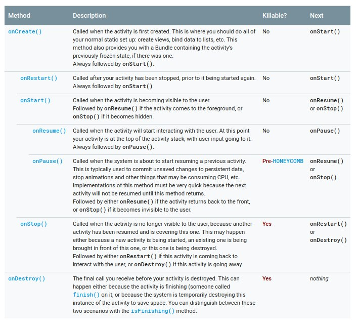
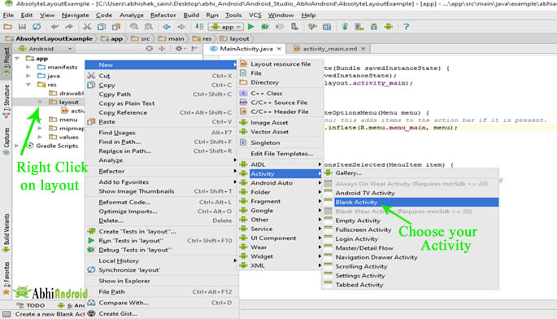
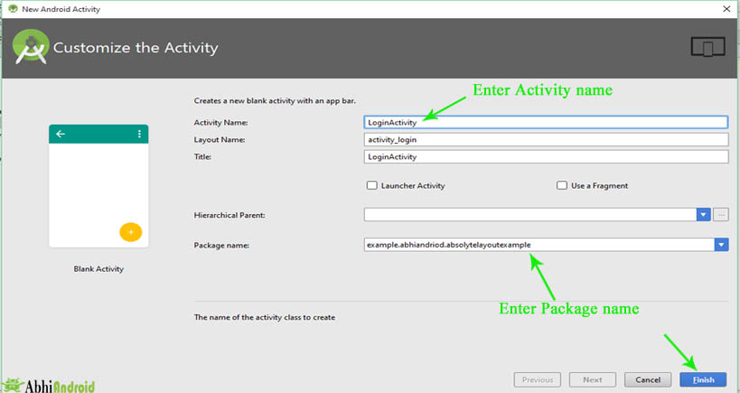
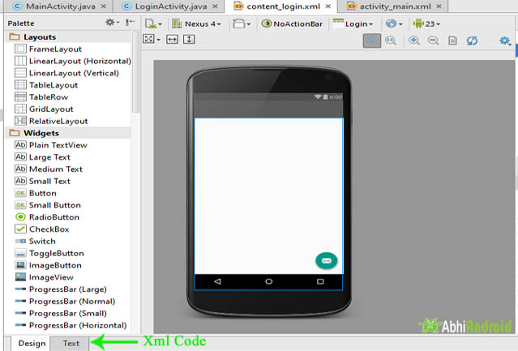

# Activities

## Conocimientos Previos

* Java básico
* Contenido del archivo AndroidManifest.xml
* Noción de las herramientas del IDE Android Studio

## ¿Qué es un activity?

<p align="justify">

El sistema operativo Android utiliza el patrón de diseño *modelo - vista - controlador*  que en pocas palabras se refiere a dividir nuestra aplicación en tres elementos básicos.

<p align="center">


</p>

1. Vista : Se encarga de la representación visual de los datos, todo lo que tenga que ver con la interfaz gráfica va aquí.
2. Controlador. Se encarga de la funcionalidad y administración de la aplicación, recibe las peticiones del usuario y si es necesario, le solicita datos al modelo y luego se los comunica a la vista.
3. Modelo. Se encarga de todo lo referido con datos, actualizaciones, búsquedas, etc. , generalmente hecho a través de consultas a una base de datos pero no necesariamente.

Dicho lo anterior, una **activity (o actividad)**  *es un componente de una aplicación (para Android OS)  que provee una pantalla con la que los usuarios pueden interacturar* y hacer uso de las funcionalidades que pueda ofrecer nuestra aplicación como por ejemplo, tomar una foto, enviar un email, ver un mapa, etc.

</p>

## Ciclo de vida de una activity

<p align="justify">

El ciclo de vida de una actividad de se refiere al estado en que esta se encuentra, es análogo al ciclo de vida de un ser vivo o al ciclo de vida del agua, etc. Para el caso particular de Android OS, el ciclo de vida de una actividad *nos permitirá declarar como se va a comportar una actividad cuando el usuario la abandona o cuando vuelve entrar a ella.*

El siguiente diagrama fue tomado directamente del sitio https://developer.android.com (allí se encuentra la documentación oficial de como desarrollar para android.) y muestra todos los métodos o estados en las que una actividad puede caer.

</p>

<p align="center">


</p>

<p align="justify">

Las actividades en android son controladas por el sistema operativo a través de la llamada *pila de de actividades (activity stack)*. Es decir, por medio de una estructura de datos y lógica de programación es como nuestras actividades pueden ser o no visibles para el usuario. Si el lector requiere de una explicación más profunda acerca del control de las actividades a nivel sistema operativo, primero será necesario que revise de manera detallada el tema de estructura de datos y su implementación en cualquier lenguaje de programación.

Una actividad puede estar en uno de los siguientes cuatro estados:

* **Activa (Active or Running).** Es cuando una actividad se encuentra en primer plano de la pantalla.

* **Pausada (Paused).** Algunas veces se traduce como visible. Una actividad se encuentra pausada si aun esta viva y visible pero no esta enfocada. Mantiene su estado y su información.

  <u>Ejemplo.</u> Cuando se estamos en cualquier aplicación de nuestro telefono y no sale una alerta de 		batería baja, la actividad se alcanza a ver pero no esta enfocada.

* **Parada (Stopped).**  Sucede cuando una segunda actividad B se pone completamente sobre una primera actividad A. Es decir, la actividad A queda en segundo plano, sin embargo su estado e información aun son retenidos por la misma. Se debe tener en cuenta que en este estado la actividad puede ser destruidad (killed) por el sistema si se llegará a necesidad memoria en otra parte.

* **Destroyed (destruida).** Si una actividad es puesta en *paused* o en *stopped*, el sistema puede eliminar la actividad de la memoria pidiéndole que termine o simplemente eliminando el proceso. Cuando se vuelve a mostrar al usuario, debe reiniciarse completamente y restaurarse a su estado anterior.

###### IMPORTARTE

> Si tras eliminar el proceso de una aplicación, el usuario vuelve a ella, se crea de nuevo el proceso, pero se habrá perdido el estado que tenía esa aplicación. En estos casos, será responsabilidad del programador almacenar el estado de las actividades, si queremos que cuando sean reiniciadas conserven su estado.

Las actividades estarán controladas por la clase *Activity* y presenta los siguientes métodos.

```java
 public class Activity extends ApplicationContext {
     protected void onCreate(Bundle savedInstanceState);

     protected void onStart();

     protected void onRestart();

     protected void onResume();

     protected void onPause();

     protected void onStop();

     protected void onDestroy();
 } 
```

Observe que hay métodos que se dan en pares, por decirlo de alguna forma, ya que el método onPause() se anula con el método onResume(), el método onStop() se anula con el método onRestart() y por último, onDestroy() no podría existir sin onCreate(...).

La siguiente tabla fue tomada de Android Developers y muestra lo que hace cada método de la clase Activity

<p align="center">



</p>

</p>

## Creación de una activity

<p align="justify">

Al iniciar un proyecto en **Android Studio**, por defecto se nos crea una actividad, que de hecho es llamada actividad principal, ya que es la primera pantalla que el usuario verá al iniciar nuestra aplicación.

Así mismo, observamos que existe un archivo llamado _activity_main.xml_ y otro llamado _MainActivity.java_, que se encuentran en la carpeta de _res/layout_ y _java_, respectivamente. Esto sucede porque se esta usando la arquitectura modelo-vista-controlador que se explico al principio de este documento.

La vista corresponde al archivo xml y el controlador al archivo con extensión .java 

##### Entonces, ¿Cómo creamos una nueva actividad?

Android Studio ofrece un asistente que nos guiará para tener una nueva actividad, los pasos que debemos seguir son los siguientes.

1. En la estructura del proyecto damos click secundario en la carpeta *layout* contenida en la siguiente ruta app/res/layout

   Después de dar click segundario, escogemos las siguientes opciones:

   * New
     * Activity
       * Blank Activity

   

2. Aparecerá el asistente para crear una nueva actividad, nos pedirá el nombre la actividad.

   

Finalmente, estamos listos para crear una nueva vista de nuestra aplicación.

​		

</p>

## Añadir una activity a la aplicación

Al crear una actividad via asistente, por defecto hace un paso muy importante el cual es incluir nuestra actividad en el archivo *AndroidManifest.xml*, es conveniente revisar que este paso se halla llevado a cabo, simplemente debe abrir dicho archivo y revisar que se parezca al siguiente snippet.

Hay varias formas de agregar la actividad al *AndroidManifest.xml*, a continuación se describen algunas.

```xml
 <!-- Main Activity-->
    <activity android:name=".YourActivityName" >
        <intent-filter>
      <!-- MAIN represents that it is the Main Activity-->
            <action android:name="android.intent.action.MAIN" />
      <!-- Launcher Denotes that it will be the first launching activity-->
            <category android:name="android.intent.category.LAUNCHER" />
        </intent-filter>
    </activity>

 <!--Add Other activities like this-->
    <activity android:name=".YourActivityName2" >
 <!--Default Intent Filter-->
        <intent-filter>
            <action android:name="android.intent.action.DEFAULT" />
        </intent-filter>
    </activity>

 <!--OR Other activities like this And  intent filter is not necessary in other activites-->
    <activity android:name=".YourActivityName3" >
    </activity>

 <!--OR Add Other activities like this-->
    <activity android:name=".YourActivityName4" />
```

## Temas siguientes

* Intents
* Fragments

