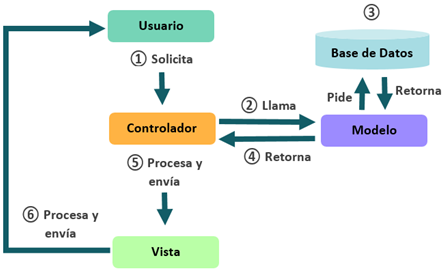

# Activities

## ¿Qué es un activity?

El sistema operativo Android utiliza el patrón de diseño *modelo - vista - controlador*  que en pocas palabras se refiere a dividir nuestra aplicación en tres elementos básicos.

1. Vista : Se encarga de la representación visual de los datos, todo lo que tenga que ver con la interfaz gráfica va aquí.
2. Controlador. Se encarga de la funcionalidad y administración de la aplicación, recibe las peticiones del usuario y si es necesario, le solicita datos al modelo y luego se los comunica a la vista.
3. Modelo. Se encarga de todo lo referido con datos, actualizaciones, búsquedas, etc. , generalmente hecho a través de consultas a una base de datos pero no necesariamente.

Dicho lo anterior, una **activity (o actividad)**  *es un componente de una aplicación (para Android OS)  que provee una pantalla con la que los usuarios pueden interacturar* y hacer uso de las funcionalidades que pueda ofrecer nuestra aplicación como por ejemplo, tomar una foto, enviar un email, ver un mapa, etc.

## Ciclo de vida de una activity

## Creación de una acitivity

## Añadir una activity a la aplicación

