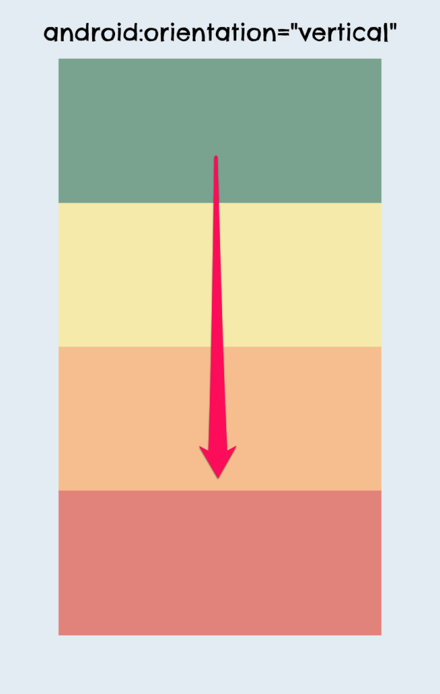
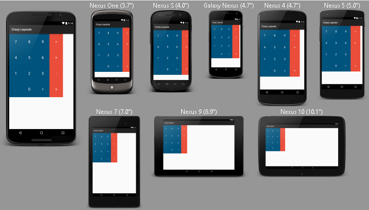

# **GUI (Graphical User Interface)**

## View


Los objetos View son empleados específicamente para dibujar contenido en la pantalla del dispositivo Android para que el usuario pueda interactuar. Mientras que puedes instanciar una View en tu código Java, la forma más sencilla de usarlo, es a través de un archivo de diseño XML.

### Grupos de Vistas o View Groups

Un ViewGroup es un objeto invisible que se usa para contener otros objetos View y ViewGroup con el fin de organizar y controlar el layout de una pantalla. Los objetos ViewGroup son utilizados para la creación de una jerarquía de objetos View de modo que pueda crear layouts más complejos.


Los objetos ViewGroup pueden ser instanciados de la misma manera que los elementos View estándar en XML o en código Java.


# Tipos de Layouts

## ¿Qué es un Layout?

Es un grupo de vista que define la estructura visual de la aplicación. Android lo utiliza para mostrar los elementos visuales en la pantalla. Los mas usados son el LinearLayout y RelativeLayout.

## LinearLayout


Alinea todos los campos secundarios en una única dirección, de manera vertical u horizontal. Puedes especificar la dirección del diseño con el atributo [`android:orientation`]

Todos los campos secundarios de un LinearLayout se apilan uno detrás de otro, por cual una lista vertical solo tendrá un campo secundario por fila, independientemente del ancho que tengan, y una lista horizontal solo tendrá la altura de una fila (la altura del campo secundario más alto, más el relleno). Un LinearLayout respeta los _márgenes_ entre los campos secundarios y la _gravedad_ (alineación a la derecha, centrada o a la izquierda) de cada campo secundario.

Codigo de implementacion de un LinearLayout, utilizando tres EditText(Más adelante veremos que son.):

```xml
<?xml version="1.0" encoding="utf-8"?>  
<LinearLayout  
xmlns:android="http://schemas.android.com/apk/res/android"  
android:layout_width="match_parent"  
android:layout_height="match_parent"  
android:paddingLeft="16dp"  
android:paddingRight="16dp"  
android:orientation="vertical"  >  

<EditText  
android:layout_width="match_parent"  
android:layout_height="wrap_content"  
android:hint="@string/to"  />

<EditText  
android:layout_width="match_parent"  
android:layout_height="wrap_content"  
android:hint="@string/subject"  />  

<EditText  
android:layout_width="match_parent"  
android:layout_height="0dp"  
android:layout_weight="1"  
android:gravity="top"  
android:hint="@string/message"  />  

</LinearLayout>


```
  
LinearLayout existe para mostrar los elementos en un orden apilado, ya sea horizontal ò verticalmente.

  
  
  
  
## RelativeLayout


Muestra las vistas de sus "hijos" en sus posiciones relativas. La posición de cada vista puede ser especificado como elementos relativos o hermanos (como el de la izquierda o el de abajo) o en posiciones relativas con el padre el RelativeLayout.

Es una herramienta muy poderosa para diseñar la interfaz de usuario por que puede eliminar los grupos de vista anidados y mantener el Layout jerárquicamente plano, lo cual mejora el desempeño de la aplicación.

El RelativeLayout permite que las vistas de los hijos pueden relacionarse con la de otros a partir de su ID. Así que puedes ordenar 2 elementos a partir de su borde derecho, o hacer que uno este debajo del otro.

Unas de las principales propiedades del RelativeLayout son las siguientes:

`android:layout_alignParentTop`

Si es  `"true"`, hace que el borde superior de esta vista coincida con el borde superior del elemento principal.

`android:layout_centerVertical`

Si es  `"true"`, centra el hijo verticalmente con el principal.

`android:layout_below`

Coloca el borde superior de esta vista debajo de la vista especificada con un ID de recurso.

`android:layout_toRightOf`

Coloca el borde izquierdo de esta vista a la derecha de la vista especificada con un ID de recurso

Un ejemplo: 

```xml
<RelativeLayout xmlns:android="http://schemas.android.com/apk/res/android"  
  android:layout_width="match_parent"  
  android:layout_height="match_parent"  
  android:paddingLeft="16dp"  
  android:paddingRight="16dp" >  
    <EditText  
  android:id="@+id/name"  
  android:layout_width="match_parent"  
  android:layout_height="wrap_content"  
  android:hint="@string/reminder" />  
    <EditText  
  android:id="@+id/mensaje1"  
  android:layout_width="0dp"  
  android:layout_height="wrap_content"  
  android:layout_below="@id/name"  
  android:layout_alignParentLeft="true"  
  android:layout_toLeftOf="@+id/mensaje2" />  
  
    <EditText  
  android:id="@id/mensaje2"  
  android:layout_width="96dp"  
  android:layout_height="wrap_content"  
  android:layout_alignEnd="@+id/name"  
  android:layout_below="@+id/name" />  
    <Button  
  android:layout_width="96dp"  
  android:layout_height="wrap_content"  
  android:layout_below="@id/mensaje2"  
  android:layout_alignParentRight="true"  
  android:text="@string/done" />  
</RelativeLayout>

```
Existen más propiedades. Se pueden checar en el API de Android:
https://developer.android.com/reference/android/widget/RelativeLayout

### RelativeLayout

Esta subclase ViewGroup, permite visualizar elementos en la pantalla relacionados entre sí, proporcionando más flexibilidad y libertad a la manera en que tu layout aparece, comparado con el LinearLayout. Dependiente a la posición de otro View

### FrameLayout

Designado para mostrar sólo un View hijo por vez, el FrameLayout dibuja los elementos en una pila y provee una manera sencilla de visualizar un elemento en diferentes tipos de tamaños de pantalla.

### ScrollView

Una extensión de FrameLayout, la clase ScrollView, maneja el despliegue de los objetos hijos en la pantalla.

### ViewPager

Utilizado para administrar vistas múltiples mientras que sólo visualiza una a la vez, la clase ViewPager acepta un Adapter y permite a los usuarios deslizarse de izquierda a derecha para ver todos los elementos View disponibles.

### RecyclerView

La clase RecyclerView es una subclase de ViewGroup que está relacionada a las clases ListView y GridView y que ha sido puesto a disposición por Google a través de [RecyclerView support library] para las versiones anteriores de Android.

### CoordinatorLayout

La clase Coordinator Layout utiliza un objeto Behavior o de Comportamiento para determinar cómo los elementos View hijos deberían ser dispuestos y movidos mientras el usuario interactúa con tu app.

  
  


### Atributos De Un Layout
Todas las características de un ViewGroup o un View son representadas a través de atributos que determinan algún aspecto.
  
Cada atributo XML descrito para un componente tiene una referencia en la clase Java que lo representa. Esto quiere decir que al usar un elemento `<TextView>` ,  nos estamos refiriendo a la clase  TextView.  
  
Identificador de un view— Existe un atributo que heredan todos los elementos llamado id. Este representa un identificador único para cada elemento. Lo que permite obtener una referencia de cada objeto de forma específica. La sintaxis para el id sería la siguiente: android:id="@+id/nombre_identificador"  
  
Donde el símbolo  `'@'`  indica al parser interno de XML, que comienza un nuevo identificador para traducir. Y el símbolo  '+'  declara que dicho id no existe aún. Por ello se da la orden para crear el identificador dentro del archivo R.java a partir del string que proporcionamos.  
Obtener view en una actividad con findViewById()— Una vez definido un id para los views que deseas manipular en el código, se usa el método  findViewById()  para obtener sus instancias.  
  
Un ejemplo:  
```xml
<TextView  
    android:id="@+id/texto_hello_world"  
    android:layout_width="wrap_content"  
    android:layout_height="wrap_content"  
    android:text="@string/hello_world"  />
 ```  
  
  
#### Dentro del Codigo Java  

```java
TextView textoHelloWorld =(TextView)findViewById(R.id.texto_hello_world);  
```  
Simplemente declaramos un objeto del tipo que de view que buscas y luego asignas el resultado que produce  findViewById(). Este recibe como parámetro la referencia que se creó dentro de R.java, la cual tiene el mismo nombre del string que usamos.  
Importante realizar el casting del view con el tipo deseado,en el caso anterior era TextView.

  
#### Parámetros De Un Layout

Los parámetros de un layout son atributos especiales que determinan cómo se relacionan los hijos de un ViewGroup dependiendo de su posición y tamaño.  
  
Estos se escriben de la forma layout_parametro para someter al view en cuestión. Programáticamente se representan como una clase interna llamada ViewGroup.LayoutParams.  
Dependiendo de la [jerarquía encontrada en el layout], así mismo se aplican los parámetros:

  
Dependiendo del  ViewGroup, así mismo será la naturaleza de los parámetros. Pero existen dos que son comunes independientemente del elemento. Estos son  layout_width y layout_height.  
#### Definir layout_widht y layout_height. 
Estos parámetros definen el ancho y la altura respectivamente de un cualquier view.  

***wrap_content*** : Ajusta el tamaño al espacio mínimo que requiere el view.  

```java
android:layout_width= "wrap_content"  
android:layout_height= "wrap_content" 
``` 
***match_parent*** : Ajusta el tamaño a las dimensiones máximas que el padre le permita. 

``` java
android:layout_width="match_parent"  
android:layout_height="wrap_content"  
```   
  
#### Alinear Elemento en el Layout  
Para alinear cada elemento dentro del  FrameLayout o LinearLayout  usa el parámetro  
```java
 android:layout_gravity.
 ``` 


El parámetro ***gravity***  se basa en las posiciones comunes de un view dentro del layout. Se describe con constantes de orientación:  
  
	

 - [ ] **top**: Indica la parte superior del layout.  
- [ ] 	**left:** Indica la parte izquierda del layout.  
- [ ] 	**right:** Se refiere a la parte derecha del layout.  	- [ ] 
- [ ] 	**bottom:** Representa el límite inferior del layout.  
- [ ] **center_horizontal:** Centro horizontal del layout.  
- [ ] **center_vertical:** Alineación al centro vertical del 		
	layout.  
- [ ] **center:** Es la combinación de center_horizontal y 	
	center_vertical.  

Como se muestra en la ilustración, es posible crear variaciones combinadas.  
  
#### FrameLayout  
Un FrameLayout  es un view group creado para mostrar un solo elemento en pantalla.  
Sin embargo puedes añadir varios hijos con el fin de superponerlos, donde el último hijo agregado, es el que se muestra en la parte superior y el resto se pone por debajo en forma de pila.  

#### LinearLayout  
Un  LinearLayout  es un view group que distribuye sus hijos en una sola dimensión establecida. Es decir, o todos organizados en una sola columna (vertical) o en una sola fila (horizontal). La orientación puedes elegir a través del atributo android:orientation.

  
Al igual que el FrameLayout, el LinearLayout permite asignar una gravedad a cada componente según el espacio que ocupa.  
  
Adicionalmente existe un parámetro llamado 

> android:layout_weight

el cual define la importancia que tiene un view dentro del linear layout. A mayor importancia, más espacio podrá ocupar

La anterior ilustración muestra tres views con pesos de 1, 2 y 3 respectivamente. Es evidente que la magnitud de sus alturas corresponde a su preponderancia. Matemáticamente, el espacio disponible total sería la suma de las alturas (6), por lo que 3 representa el 50%, 2 el 33,33% y 1 el 16,66%.  
  
Aunque esto podemos deducirlo por compresión, es posible definir la suma total del espacio con el atributo android:weightSum. 
Dependiendo de este valor, los weights serán ajustados. **android:weightSum="6"**  
  
Para distribuir todos los elementos sobre el espacio total del layout, puedes usar el atributo height con valor cero.  
**android:layout_height="0dp"  
android:layout_weight="3"**  
Si no lo haces, el relleno del espacio se definirá por las alturas que tú hayas definido, lo que tal vez no complete el espacio total.  
  
#### RelativeLayout  
Este elemento es el más flexible y elaborado de todos los view groups que veremos. El  RelativeLayout permite alinear cada hijo con referencias subjetivas de cada hermano.  
Con el  RelativeLayout  pensaremos en cómo alinear los bordes de cada view con otros. Imagina en una sentencia como “el botón estará por debajo del texto” o “la imagen se encuentra a la derecha de la descripción”.  
En ninguno de los casos nos referimos a una posición absoluta o un espacio determinado. Simplemente describimos la ubicación y el framework de Android computará el resultado final.

El ejemplo anterior ilustra como una serie de views forman un diseño irregular. Esto es posible gracias a unos parámetros que determinan cómo se juntan los bordes de cada uno y en qué alineación.  
  
Veamos algunos de los [parámetros del RelativeLayout](http://developer.android.com/intl/es/reference/android/widget/RelativeLayout.LayoutParams.html) para definir posiciones:  
android:layout_above: Posiciona el borde inferior del elemento actual con el borde superior del view referenciado con el id indicado.  

 - [ ] **android:layout_centerHorizontal**: Usa true para indicar que el
       view será centrado horizontalmente con respecto al padre.  
      
 - [ ]  **android:layout_alignParentBottom:** Usa true para alinear el borde inferior de este view con el borde inferior del padre.  
       
 - [ ] **android:layout_alignStart:** Alinea el borde inicial de este
       elemento con el borde inicial del view referido por id.

  
### TableLayout  
TableLayout views en filas y columnas de forma tabular.  
  
Para crear las filas se usa el componente TableRow dentro del TableLayout. Cada celda es declarada como un view de cualquier tipo (imagen, texto, otro group view, etc.) dentro de la fila. Sin embargo, puedes crear una celda con otro tipo de view. Esto hará que todo el espacio de la fila sea ocupado por el objeto.  
  
El TableRow trae consigo un parámetro llamado android:layout_column para asignar la columna a la que pertenece cada celda en su interior. Incluso puedes usar el parámetro weight para declarar pesos de las celdas.  
  
El ancho de cada columna es definido tomando como referencia la celda más ancha. 

Pero también podemos definir el comportamiento del ancho de las celdas con los siguientes atributos:  
  

 - [ ] **android:shrinkColumns:** Reduce el ancho de la columna seleccionada hasta ajustar la fila al tamaño del padre.  
android:stretchColumns: Permite rellenar el espacio vacío que queda en el TableLayout, expandiendo la columna seleccionada.  
  
### GridLayout  
Un GridLayout es un ViewGroup que alinea sus elementos hijos en una cuadrícula (grilla ó grid). Nace con el fin de evitar anidar linear layouts para crear diseños complejos.  
Su funcionamiento se basa en un sistema de índices con inicio en cero. Es decir, la primera columna (o fila) tiene asignado el índice 0, la segunda el 1, la tercera el 2, etc.

Los atributos más importantes del GridLayout son:  
columnCount: Cantidad de columnas que tendrá la grilla.  
rowCount: Cantidad de filas de la cuadrícula.  
useDefaultMargins: Si asignas el valor de true para establecer márgenes predeterminadas entre los ítems.  
  
En cuanto a sus parámetros, es posible especificar la cantidad de filas y columnas que ocupará una celda a través de los atributos android:layout_rowSpan y android:layout_columnSpan. Esta característica nos posibilita para crear diseños irregulares que un TableLayout no permitiría.

## Diseño De Layouts Con Android Studio  
El editor visual de Android Studio facilita la creación de layouts con un sistema de drag and drop. Esto quiere decir, que podemos arrastrar elementos desde un panel hacia el lienzo del layout y ubicarlos instantáneamente.  
Incluso podemos modificar los atributos y parámetros de forma visual sin tener que tocar el código XML.


En la vista de diseño tendremos una sección llamada Palette, la cual contiene todos los elementos gráficos posibles que podemos implementar dentro de un layout. Desde este lugar puedes seleccionar cualquier elemento y arrastrarlo al lienzo. Dentro de esta existen varias categorías, como Layouts.  
El lienzo es simplemente la representación visual en tiempo real de la interfaz de la aplicación. Cuando arrastras un elemento de la paleta hacia el lienzo, este proyecta guías visuales para indicar cómo será acomodado el view si lo sueltas en esa posición.  
El panel de propiedades (Properties) muestra los atributos del view seleccionado. En el veremos una lista con pares clave-valor para escoger las opciones que deseamos sin ver el código XML.

Cambiar versión de Android— En las variaciones del editor visual, podemos cambiar la versión de Android con que se está mostrando el layout actual.  
Si presionas la opción Preview Android Versions se desplegarán al mismo tiempo varios layouts con el diseño actual.


Visualizar layouts con múltiples idiomas— Si tienes traducciones para los strings relacionados a tus layouts, entonces puedes las respectivas variaciones con la opción del globo.

  
  
  

Rotar pantalla en Android Studio— Para cambiar de portrait a landscape o viceversa, utiliza el icono del dispositivo móvil con una flecha de rotación.


Visualizar el layout con un dispositivo diferente— Es posible emplear diferentes dispositivos para comprobar el funcionamiento del layout en densidades alternas.


Por otro lado, si eliges la opción Preview All Screen Sizes, Android Studio proyectará el layout en todos los dispositivos disponibles.



Solucionaremos esto creando un layout especial para orientación horizontal, donde haremos el cambio. Ve a la primera opción donde se ve un icono de un archivo junto al logo de android. Esto desplegará una lista de varias opciones, pero la que nos interesa es Create Landscape Variation

# Widgets básicos

**TextView**
		Etiqueta de Texto
``` xml 
<?xml version="1.0" encoding="utf-8"?>  
<LinearLayout
  xmlns:android="http://schemas.android.com/apk/res/android"  xmlns:app="http://schemas.android.com/apk/res-auto"  
  android:layout_width="match_parent"  
  android:layout_height="match_parent">  <TextView  
  android:layout_width="match_parent"  
  android:layout_height="200dp"  
  app:autoSizeTextType="uniform"  />  
  
</LinearLayout>
	```
```


**ImageView** 
		El ImageView es designado específicamente para 		
		mostrar imágenes en la pantalla.
```xml 
 <LinearLayout
  xmlns:android="http://schemas.android.com/apk/res/android"
  android:layout_width="match_parent"
  android:layout_height="match_parent">
  <ImageView
   android:layout_width="wrap_content"
   android:layout_height="wrap_content"
   android:src="@mipmap/ic_launcher"/>
  </LinearLayout>
```

```xml 
```
**Button**
		La clase Button es uno de los controles más 	
		básicos disponibles en la app. Escucha los 
		clicks del usuario y llama a un método en tu 
		código, de forma que puedas responder 
		apropiadamente.
		
``` xml
	 <Button
     android:id="@+id/button_id"
     android:layout_height="wrap_content"
     android:layout_width="wrap_content"
     android:text="@string/self_destruct" /> 
```

```java 
public class MyActivity extends Activity {
     protected void onCreate(Bundle savedInstanceState) {
         super.onCreate(savedInstanceState);

         setContentView(R.layout.content_layout_id);

         final Button button = findViewById(R.id.button_id);
         button.setOnClickListener(new View.OnClickListener() {
             public void onClick(View v) {
                 // Code here executes on main thread after user presses button
             }
         });
     }
 }
```

 ``` xml 
<Button  
android:layout_width="wrap_content"  
android:layout_height="wrap_content"  
android:text="@string/button_text" ...
 />

<ImageButton  
android:layout_width="wrap_content"  
android:layout_height="wrap_content"  
android:src="@drawable/button_icon" ... />

<Button  
android:layout_width="wrap_content"  
android:layout_height="wrap_content"  
android:text="@string/button_text"  
android:drawableLeft="@drawable/button_icon" ...
 />

```
   

**EditText**
		Esta subclase View es una extensión de la clase 	
		TextView y permite a los usuarios actualizar el 
		texto que figura a través de una entrada de 
		teclado.
```xml
<?xml version="1.0" encoding="utf-8"?>  <RelativeLayout >  
<EditText  android:id="@+id/campo_texto"  
android:layout_width="match_parent"  
android:layout_height="wrap_content"  
android:layout_centerHorizontal="true"  
android:layout_centerVertical="true"  
android:hint="Texto de entrada"  />  
</RelativeLayout>
```
# Manejo de Eventos

Al considerar los eventos dentro de tu interfaz de usuario, el enfoque consiste en capturar los eventos desde el objeto de vista específico con el que el usuario interactúa. La clase de vista proporciona los medios para hacerlo.

Dentro de las diversas clases de objetos View que usarás para componer tu diseño, quizá observes varios métodos de callback públicos que pueden ser útiles para eventos de IU. El framework de Android llama a estos métodos cuando la acción respectiva ocurre en ese objeto. Extender todos los objetos de vista para manejar tal evento no sería práctico. Es por ello que la clase de vista también contiene una colección de interfaces anidadas con callbacks que puedes definir más fácilmente. Estas interfaces, llamadas gestores de eventos, te permiten capturar la interacción del usuario con tu IU.

Si bien generalmente usarás los receptores de eventos para escuchar la interacción del usuario, es posible que en algún momento desees ampliar una clase de objeto View para crear un componente personalizado. Quizá desees ampliar la clase  Button  para crear algo más elaborado. En este caso, podrás definir los comportamientos de eventos predeterminados para tu clase utilizando los  **controladores de eventos** de la clase.

## Gestores de eventos

Un receptor de eventos es una interfaz en la clase  [View]  que contiene un solo método de callback. Estos métodos serán llamados por el framework de Android cuando la vista con la cual se ha registrado el gestor sea iniciada por la interacción del usuario con el elemento en la IU.

En las interfaces de los gestores de eventos, se incluyen los siguientes métodos de callback:

`onClick()`

Desde  View.OnClickListener Este método se llama cuando el usuario toca el elemento (en el modo táctil), o selecciona el elemento con las teclas de navegación o la bola de seguimiento y presiona la tecla “Entrar” adecuada o la bola de seguimiento.

`onLongClick()`

Desde  View.OnLongClickListener . Este método se llama cuando el usuario toca y mantiene presionado el elemento (en el modo táctil), o selecciona el elemento con las teclas de navegación o la bola de seguimiento y mantiene presionada la tecla “Entrar” adecuada o la bola de seguimiento (durante un segundo). Este método muestra un valor booleano para indicar si has consumido el evento y si no debe continuar. 

`onFocusChange()`

Desde  View.OnFocusChangeListener. Este método se llama cuando el usuario navega hacia el elemento o sale de este utilizando las teclas de navegación o la bola de seguimiento.

`onKey()`

Desde  View.OnKeyListener. Este método se llama cuando el usuario se centra en el elemento y presiona o libera una tecla física en el dispositivo. Este método muestra un valor booleano para indicar si has consumido el evento y si no debe continuar.

`onTouch()`

Desde  View.OnTouchListener. Este método se llama cuando el usuario realiza una acción calificada como un evento táctil, por ejemplo, presionar, liberar o cualquier gesto de movimiento en la pantalla (dentro de los límites del elemento). Este método muestra un valor booleano para indicar si tu receptor consume este evento. Lo importante es que este evento puede tener múltiples acciones una después de la otra. Por lo tanto, si devuelve _false_ cuando se recibe el evento de acción de abajo, tú indicas que no has consumido el evento y también que no estás interesado en las acciones subsiguientes de este evento. Por ende, no se te llamará para otras acciones dentro del evento, como un gesto del dedo, o el evento de acción de arriba final.

`onCreateContextMenu()`

Desde  View.OnCreateContextMenuListener . Este método es llamado cuando se crea un Context Menu (como resultado de un "clic largo" sostenido). Consulta la explicación sobre menús contextuales en la guía para desarrolladores Menus.

Estos métodos son los únicos habitantes de su respectiva interfaz. Para definir uno de estos métodos y manejar sus eventos, implementa la interfaz anidada en su actividad o defínela como una clase anónima. Luego, pasa una instancia de tu implementación al método  `View.set...Listener()`  respectivo. (P. ej., llama a  setOnClickListener() y pasa tu implementación de OnClickListener).

En el ejemplo siguiente, se muestra cómo registrar un gestor onClick para un botón.

```java
private  OnClickListener mCorkyListener =  new OnClickListener()  {  
	public  void onClick(View v)  {  
		// Realizar una accion cuando se oprime el boton
		}  
};

protected  void onCreate(Bundle savedValues)  {  ...  
	// Encontrar el boton en el Layout  
	Button button =  (Button)findViewById(R.id.corky);  
	// Registrar el onClickListener
	button.setOnClickListener(mCorkyListener);  ...  
}
```

En el caso de un dispositivo con funciones táctiles, una vez que el usuario toca la pantalla, el dispositivo entra en el modo táctil. Desde este momento en adelante, solo las vistas para las cuales el  isFocusableInTouchMode()  es verdadero serán enfocables. Otras vistas que son táctiles, como los botones, no se enfocarán cuando se las toca; simplemente activan sus gestores onClick cuando se las presiona.

El estado del modo táctil se mantiene en todo el sistema (todas las ventanas y actividades). Para consultar el estado actual, puedes llamar a  isInTouchMode() a fin de ver si el dispositivo se encuentra actualmente en el modo táctil.
