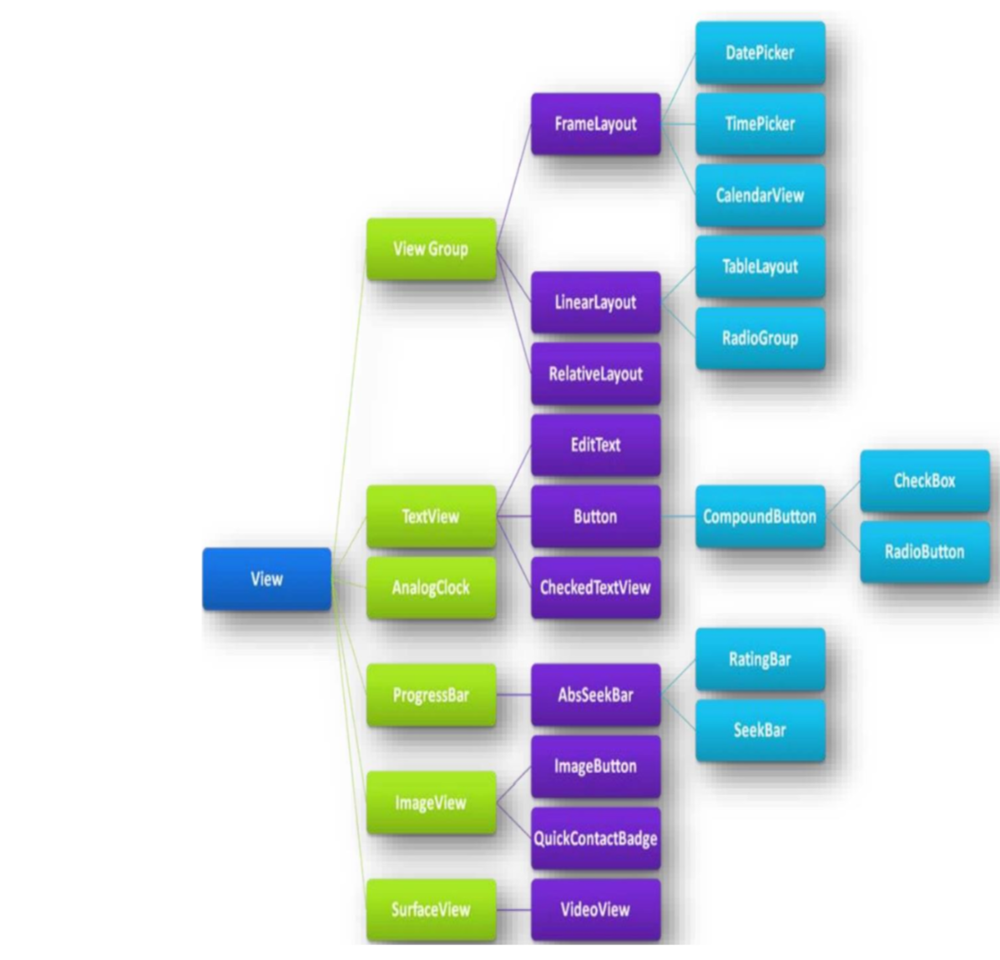
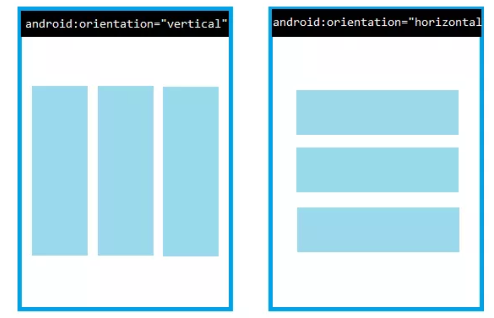
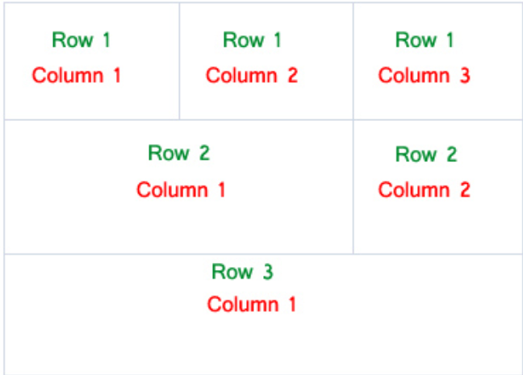
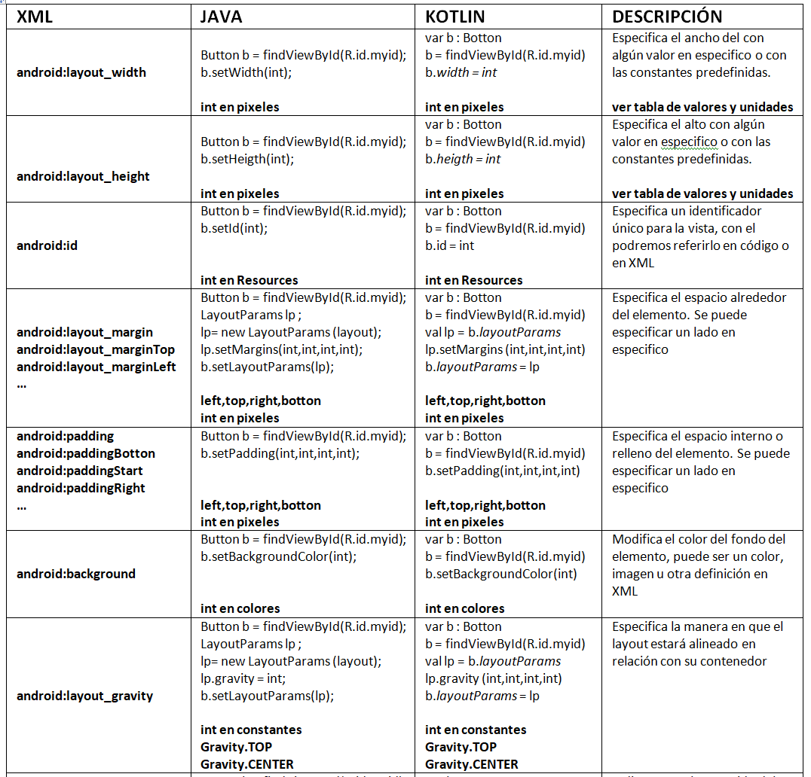
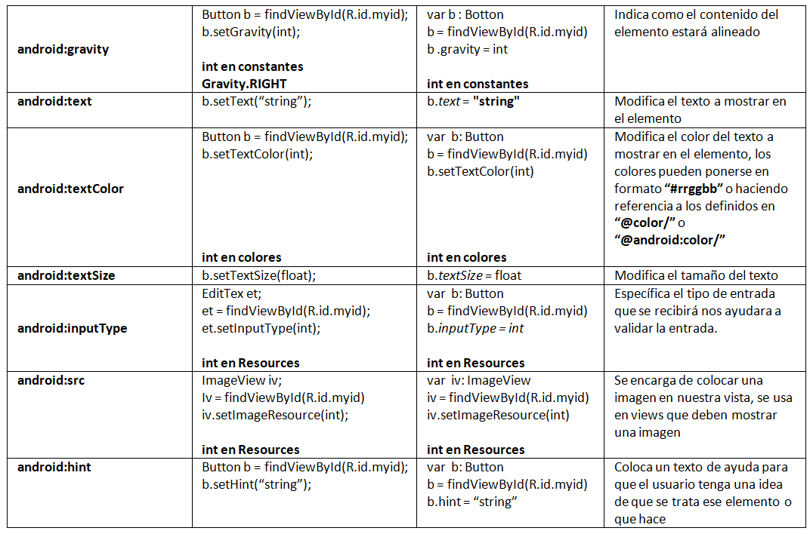
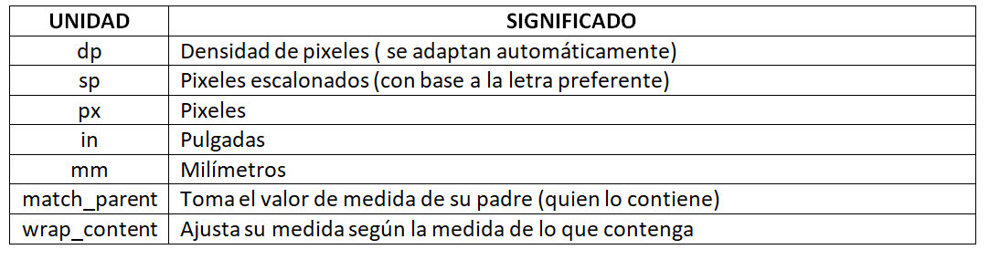

# Manual GUI 

Desde el punto de vista del usuario una aplicación móvil consta de dos elementos principales:
> 1. Interfaz Gráfica
> 2. Funcionalidad

Para entrar en materia de la interfaz de usuario en android primero es importante aclarar y entender algunos conceptos

----
## ¿Qué es la UI?

UI (por sus siglas en inglés User Interface) o en español Interfaz del Usuario, es la vista que permite a un usuario interactuar de manera efectiva con un sistema. Es la suma de una arquitectura de información + elementos visuales + patrones de interacción.
El UI da el ‘look & feel’ al producto con la estructura e interacción de los elementos de la interfaz.

A pesar de la importancia de la UI como vista principal de nuestra aplicación hoy en dia ya no es suficiente y requiere de complementarse con UX.
			
----
## ¿Qué es la UX?

UX (por sus siglas en inglés User eXperience) o en español Experiencia de Usuario, es aquello que una persona percibe al interactuar con un producto o servicio. Logramos una buena UX al enfocarnos en diseñar productos útiles, usables y deseables, lo cual influye en que el usuario se sienta satisfecho y feliz.

Una buena UX se logra a través del Diseño Centrado en el Humano, el cual es el enfoque de conocer las necesidades de los usuarios y alinearlos a los objetivos del negocio tomando también en cuenta las limitaciones técnicas.

----
## View
Después de haber visto los conceptos a considerar para realizar buenas interfaces graficas entremos en materia de la creación de ellas.

Para realizar los diseños de cada vista para la aplicación android nos permite crear los elementos que la compondrán estos elementos son llamados widgets o mejor referidos como views.

Una view (vista) son todos los objetos descendientes de la clase View que nos permiten construir los componentes para la interfaz de usuario. Existen diferentes tipos de view y esos se van clasificando según su herencia de la clase padre View,
a continuación se muestra parte de las herencia de esta clase.

La clase que resaltaremos ahora es ViewGroup ya que esta clase forma los diferentes tipos de contenedores que existen en android. Un contenedor agrupa y distribuye los elementos que necesitamos para darle forma a nuestra interfaz de usuario. Hay distintos tipos de ellos los principales son:

1. LinearLayout: 
Coloca las vistas una a continuación de otra, sin superponerlas, es decir, las alinea.Esta alineación puede ser vertical u horizontal. Es decir, su distribución sirve para colocar vistas en una misma fila o columna, pero no ambas a la vez.

Las vistas se colocan en el mismo orden en se agregan al diseño o en el que aparecen en el archivo XML.

De forma predeterminada, LinearLayout tiende a establecer el mismo tamaño para cada vista que contiene, repartiendo el espacio disponible de forma equitativa entre todas ellas. 

2. TableLayout: 
Distribuyen los elementos en Forma tabular. Hay una vista específica que sólo se puede utilizar en TableLayout y que es la que aporta la funcionalidad necesaria para crear la tabla: TableRow.

TableRow es, a su vez, otra especialización de LinearLayout. Esta vez de un LinearLayout horizontal. Así que resulta evidente que, lo que se nos vende como una estructura de tabla, es en realidad un grupo de LinearLayout horizontales dentro de un LinearLayout vertical.

Lo que diferencia a TableLayout de una estructura similar creada con varios LinearLayout es el tratamiento global que le da a las vistas que se incluyen en todos los TableRow. Para empezar, aunque cada TableRow tenga una cantidad diferente de vistas en su interior, el conjunto se representará como una tabla donde todas las filas tienen el mismo número de columnas. La cantidad total de columnas que tendrá la tabla la determina el TableRow que más vistas incluya. De forma similar, el ancho de cada columna también vendrá determinado por la vista con mayor anchura de todas las incluidas en esa columna, aún estando en diferentes TableRow.

3. RelativeLayout: 
Distribuyen los elementos con relación a otros.

            IMAGEN

4. AbsoluteLayout: Forma absoluta.
Distribuyen los elementos de forma absoluta lo cual resulta un poco inconveniente para la responsividad.

              IMAGEN

Ahora bien, las view cuentan con diversos atributos para ser modificados y lograr un diseño más personalizado cambiando el tipo de letra, el fondo, el tamaño, etcetera.

A continuación se describen los atributos más usados esta tabla te será de mucha ayuda más adelante para personalizar las vistas según tu diseño.

### Tabla de valores y unidades

----
## XML

Como se ve en la imagen la primera línea del XML consta del prologo en el se declara la codificación y otros detalles correspondientes al contenido del XML.
La siguiente línea es la manera de realizar comentarios en XML estos no interfieren con el resultado del XML solamente ayudan a tener notas. 
Posteriormente tenemos nuestra primera view, cabe aclarar que todos los widgets que se utilizan en android serán llamados views debido a su clase padre como veremos más adelante. 
El que se muestra (LinealLayout) es de tipo contenedor, el contenedor padre tendrá las siguientes 3 líneas para importar los elementos contenidos en las librerías android, app y tools respectivamente.

    xmlns:android="http://schemas.android.com/apk/res/android"
    xmlns:app="http://schemas.android.com/apk/res-auto"
    xmlns:tools="http://schemas.android.com/tools"

- Para practicar los diferentes tipos de contenedores ve al ejercicio número 1, 2 y 3 al final del tema de GUI
- Para practicar los diferentes tipos de views ve al ejercicio número 4 al final del tema de GUI

----
## Ejercicios

1. Usando únicamente contenedores de tipo RelativeLayout realizar la siguiente UI:

		imagenerl

2. Usando únicamente contenedores de tipo TableLayout realizar la siguiente UI:

        imagenetl

3. Usando únicamente contenedores de tipo LinearLayout realizar la siguiente UI:

		imagenell

----
## Solución

1.

2.

3.
