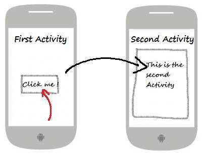

# Intents

<!--ts-->
   * [Intents](#intents)
      * [Consideraciones](#consideraciones)
      * [Conocimientos Previos](#conocimientos-previos)
      * [¿Qué es un intent?](#qué-es-un-intent)
                  * [Los intent puden ser usados para :](#los-intent-puden-ser-usados-para-)
               * [Iniciar una nueva actividad](#iniciar-una-nueva-actividad)
               * [Iniciar un servicio](#iniciar-un-servicio)
                  * [IMPORTANTE](#importante)
               * [Transmitir un broadcast](#transmitir-un-broadcast)
      * [Intent explícito](#intent-explícito)
      * [Intent implícito](#intent-implícito)
      * [Temas siguientes](#temas-siguientes)

<!-- Added by: rho, at: 2018-05-12T21:22-05:00 -->

<!--te-->

## Consideraciones

## Conocimientos Previos

* Versiones de API
* Elementos de GUI (vistas y contenedores)
* Activities
* Noción o definición de servicio

## ¿Qué es un intent?

Un intent es una descripción abstracta de una operación a realizar. En otras palabras, es un objeto de mensajería que puede ser usada para solicitar una acción de otro componete de la aplicación.

###### Los intent puden ser usados para :

1. Iniciar otra actividad
2. Iniciar un servicio
3. Entregar un broadcast (mensaje)

##### Iniciar una nueva actividad

La función más común de los *intents* es la de empezar una nueva actividad. Es posible iniciar una nueva instancia de una actividad pasando un *intent* al método `startActivity()` .

El intent le dice a la acitividad que debe iniciar y además de ello le *proporciona la información necesaria.*

##### Iniciar un servicio

Se hace los mismo que para activity, el Intent describe que el serivicio debe iniciar y cargar la información necesaria para ser transferida al método `startService()`.

###### IMPORTANTE

> Es importante revisar la versión de API con la que se este trabajando ya que a partir de Android 5.0, para iniciar un servicio se usan los métodos de la clase  JobScheduler en lugar de startService()

##### Transmitir un broadcast

Puede transmitir un broadcast (mensaje) a otras aplicaciones pasando un Intent con los siguientes métodos, `sendBroadcast ()` o `sendOrderedBroadcast ()`.

Existen dos tipos de *intents*, que son em explícito y el implícito, a continuación se aclara a que se refiere cada uno y cuando es que debemos de utilizarlos.

## Intent explícito

Un intent explícito sucede cuando el programador específica la aplicación que va a satisface el *intent*, esto sucede comunmente cuando se quiere iniciar un componente de nuestra aplicación.

## Intent implícito

Un *intent* sucede cuando no se específica el nombre del componenete a iniciar, pero en lugar de ello se declara la acción general a ser ejecutada. 

Por ejemplo. Cuando queremos mostrar la ubicación del usuario se usa un intent implícito para solicitar que otra aplicación  capaz de mostrar mapas sea abierta.

## Temas siguientes

* Alerts
* Fragments

