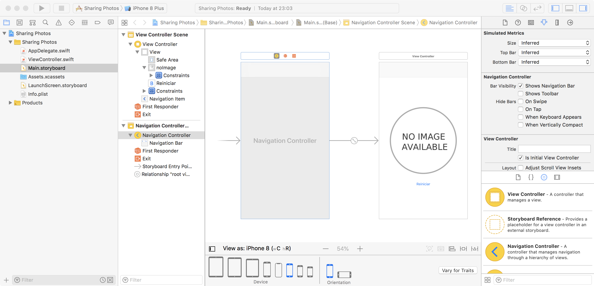

# Opcionales

**Swift** está diseñado para ser un *lenguaje seguro*. La seguridad es uno de los [principios][Principios de Swift] bajo los que se fundamenta el lenguaje. 

> **Seguridad**. La forma más obvia de escribir código también debe comportarse de manera segura. El comportamiento indefinido es el enemigo de la seguridad, y los errores de un desarrollador deben atraparse antes de que el software se encuentre en producción. Optar por seguridad a veces significa que Swift se sienta estricto, pero creemos que la claridad salva tiempo a largo plazo.


Algunos mecanismos que emplea Swift para ser seguro son los siguientes:

* Todas las variables deben inicializarse antes de poder ser usadas.
* Se verifican los límites de un arreglo en tiempo de ejecución.
* El manejo de la memoria se realiza automáticamente.


## ¿Qué es un valor nulo?

Un valor nulo es la ausencia de valor (de un dato) para una variable. En la realidad existen casos en los que la ausencia de valor para una variable es adecuada. 

Supongamos que tenemos una arreglo de nombres `items` y que queremos codificar una función que nos devuelva la posición en el arreglo de algún nombre en particular.


```swift
var items = ["Ángel", "Yuri", "Mariana", "Pedro"]
```

Un primer intento para codificar esta función podría ser la siguiente:

```swift
func posicion(de cadena: String, en arreglo: [String]) -> Int
{
	for i in 0 ..< arreglo.count
	{
		if arreglo[i] == cadena
		{
			return i
		}
	}

	return 0
}
```

Ahora decidimos probar nuestro código con las siguientes líneas.

```swift
let posicionAngel = posicion(de: "Ángel", en: items)
let posicionYuri = posicion(de: "Yuri", en: items)
let posicionMariana = posicion(de: "Mariana", en: items)
let posicionEdgar = posicion(de: "Edgar", en: items)
```

El primer error que podemos notar es que la función nos devuelve `0` para la posición de Edgar. Obviamente nuestro código tiene un error de lógica puesto que en esa posición sólo puede encontrarse el nombre de Ángel. Una posible solución sería devolver el valor de `-1` para el caso en el que un nombre no se encuentre en el arreglo. Elegir este camino soluciona el problema, pero tiene el pequeño detalle en que necesitamos recordar lo que el `-1` significa. En una aplicación más grande, en donde tengamos varios archivos, recordar el significado que le damos a un valor abstracto puede no ser lo más conveniente puesto que podríamos llegar a confundirnos por el tamaño del código. Por suerte, Swift propone una solución a esta situación con los llamados *opcionales*.

### Solución utilizando opcionales.

Un opcional es un tipo de dato especial que **puede contener o no un valor**. La ausencia de valor se representa por medio de la palabra reservada `nil`. Un opcional puede reconocerse en el código por los símbolos `?` y `!`. Por ejemplo, al declarar un número entero se utiliza `Int`y éste puede contener números como `1`, `-1`, `2048`; por otro lado, si se desea declarar un opcional de un número entero se utiliza `Int?` y éste puede contener de la misma manera números como `1`, `2000`, `-23` o no contener ningún valor (`nil`). Los opcionales pueden utilizarse con cualquier tipo de dato que tengamos: `String?`, `Double?`, `[String]?` e incluso con clases, estructuras y enumeraciones que nosotros definamos: `Persona?`, `Usuario?`, `UIColor?`, etcétera.


La solución a nuestro problema anterior consiste en lo siguiente. Cambiaremos la definición de la función para que devuelva un entero opcional `Int?`. Cuando encontremos la posición de un nombre, devolveremos un número entero, o `nil` en caso de que el nombre no se encuentre en el arreglo.

```swift
func posicion(de cadena: String, en arreglo: [String]) -> Int?
{
	for i in 0 ..< arreglo.count
	{
		if arreglo[i] == cadena
		{
			return i
		}
	}

	return nil
}
```

Ahora, la posición de Edgar está marcada como `nil` o bien, no tiene un valor en el arreglo de nombres. Esta sintaxis es similar a la que se utiliza en el método `index(of: [T]) -> Int?` que tienen todos los arreglos para buscar un elemento en ellos.

*Nota: `T` denota un tipo de dato genérico*


Los opcionales son un tema un poco complicado de entender en un principio, pero al irlos usando su complejidad se va haciendo cada vez menor.

## Desenvolver un opcional

En un Playground escribe el siguiente código:

```swift
var producto: String? = "iPhone X"
var posicion: Int? = 30
```

Nuestras variables están declaradas como opcionales, por lo que pueden contener un valor o ser `nil`. ¿Qué pasa si intentamos utilizarlas?

```swift
print("El producto es \(producto)")
print("La posición es \(posicion)")
```

Si observamos en la consola, nos daremos cuenta que tenemos unas impresiones en pantalla un tanto extrañas: "`El producto es Optional("iPhone X")`" y "`La posición es Optional(30)`". ¿Por qué sucede esto?

Antes de poder utilizar una variable opcional es necesario **desenvolverla**. Esto evita que utilicemos accidentalmente una variable que no tiene valor para realizar alguna operación, lo que causaría que nuestra aplicación lanzara un error y se cierre. Para desenvolver un opcional se utiliza el operador `!` de la siguiente manera:

```swift 
print("El producto es \(producto!)")
print("La posición es \(posicion!)")
```

Al desenvolver un opcional obtenemos el valor que este contiene. Sin embargo, ¿qué pasaría si cambiamos el valor de `producto` a `nil` e intentamos desenvolver la variable?

```swift
producto = nil
print("El producto es \(producto!)")
```

Obtendremos un error debido a que estamos intentando utilizar un valor que no existe.


Hay que tener cuidado al desenvolver un opcional cuando no estemos seguros de que este pueda tener o no un valor. Podríamos realizar la siguiente verificación antes de usarlo:

```swift
if nil != producto
{
	print("El producto es \(producto!)")
}
```

Este código es válido y funciona, pero si tuviéramos muchas variables y quisiéramos verificar todas tendríamos que utilizar varias veces el operador `&&` en la condición del if y luego desenvolver todas en el bloque de código dentro del if, lo que causaría que nuestro código se vuelva difícil de leer y lleno de `!`.

Swift propone una solución para esta situación con una construcción especial `if let` que veremos a continuación.

### `if let`

La sintaxis `if let` nos permite desenvolver un valor opcional de forma segura con un if. La sintaxis es la siguiente:

```swift
if let valorDesenvuelto = variableOpcional{
	// Código
}
```

Esta sintaxis nos dice: si el opcional `variableOpcional` tiene un valor, asignalo a la constante `valorDesenvuelto`. En caso contrario, la condición del if es falsa y el bloque de código no se ejecuta.

Para probar esta sintaxis, utilizaremos `producto` y `posicion`.

```swift
if let valorProducto = producto 
{
	print("El valor desenvuelto de producto es \(valorProducto)")
}
else
{
	print("producto no tiene valor")
}

if let valorPosicion = posicion
{
	print("El valor desenvuelto de posicion es: \(valorPosicion)")
}
else
{
	print("posicion no tiene valor")
}
```

Como producto no tiene un valor, la condición del primer `if let` es falsa y se ejecuta el bloque `else`. Por otro lado, como `posicion` sí tiene un valor definido, Swift asigna el valor desenvuelto a la constante `valorPosicion`, la condición del `if let` es verdadera y se ejecuta el bloque de código.

Si quisiéramos comprobar el valor de muchas variables en un solo `if let`, las variables se separan por comas:

```swift
if let valorUno = opcionalUno, let valorDos = opcionalDos, let valorTres = opcionalTres
{
	//	Este bloque se ejecuta sólo si los tres opcionales tienen valor.
}
```

## Opcionales desenvueltos implícitamente

Existe una forma de utilizar el valor de un opcional sin tener que desenvolverlo. Esto se logra declarando las variables con `!` en lugar de `?`. Veamos un ejemplo:

```swift
var numero: Int! = 40	// numero puede contener enteros o ser nil

print("El número es \(numero)")
```

Como se puede observar, el opcional no necesitó ser desenvuelto para poder utilizar su valor. 

Es **necesario tener cuidado** al usar de esta manera los opcionales ya Swift omite las verificaciones de seguridad que realiza con opcionales normales. Esto significa que si nuestro opcional no tiene un valor, Swift no checará esto por nosotros y nuestra aplicación mandará un error.


### Resumen de opcionales

En Swift tenemos 3 tipos de variables: **no opcionales**, **opcionales** y **opcionales desenvueltos implícitamente**. Las principales diferencias entre ellas son las siguientes:

* **No opcionales** (ej. `String`): Necesitan tener un valor como `"Hola"`, `""` (la cadena vacía no cuenta como `nil`), `"34"`. Estas variables no pueden ser `nil`. 

* **Opcionales** (ej. `String?`): Pueden contener o no un valor. Si contienen un valor, este necesita desenvolverse antes de poder ser usado. Se recomienda utilizar la sintaxis `if let` para desenvolver este tipo de opcionales.

* **Opcionales desenvueltos implícitamente** (ej. `String!`): Pueden contener o no un valor. Si contienen un valor, no es necesario desenvolverlos para poder usarlo. Es necesario tener más cuidado con ellos ya que, si no contienen un valor y se intenta usarlo, la aplicación mandará un error y se cerrará. Por extraño que parezca, la gran mayoría de variables usadas en los frameworks de Apple son de este tipo de opcionales debido a que se requería compatibilidad con código hecho en Objective-C, donde los opcionales no existían.

## Encadenamiento opcional (Optional chaining)

Trabajar con opcionales podría parecer tonto o estorboso en algunas ocasiones por el trabajo extra que se necesita para desenvolverlos. Swift implementa otras estrategias para poder usar a los opcionales y que el código se mantenga pequeño y fácil de leer. 

Como ejemplo, utilizaremos una estructura `Usuario` que almacene su nombre, su contraseña, su edad y una pequeña descripción suya de forma opcional.

```swift
struct Usuario
{
	var nombre: String
	var password: String 
	var edad: UInt8		//	Entero sin signo de 8 bits (0 - 255)
	var descripcion: String?

	init(nombre: String, password: String, 
		edad: UInt8, descripcion: String? = nil)
	{
		self.nombre = nombre
		self.password = password
		self.edad = edad
		self.descripcion = descripcion
	}
}

let angel = Usuario(nombre: "Ángel", password: "password123", edad: 21,
 descripcion: "Estudiante de octavo semestre de Ingeniería en Computación de la Facultad de Ingeniería.")
```

Ahora supongamos que en nuestra aplicación queremos mostrar la descripción, si existe, en mayúsculas. Todo `String` tiene un método `uppercased()` que nos devuelve el contenido de la cadena en mayúsculas. Podríamos intentar las siguientes dos soluciones para lograr esta tarea:

```swift
// 1:
if let descripcion = angel.descripcion {
	print(descripcion.uppercased())
}

// 2:
if nil != angel.descripcion {
	print(angel.descripcion!.uppercased())
}
```

Sin embargo, Swift nos ofrece una sintaxis especial para poder trabajar con el valor del opcional directamente antes de desenvolverlo:

```swift
let mayusculas = angel.descripcion?.uppercased()
```

La línea `angel.descripcion?.uppercased()` utiliza el operador `?.`. Si descripción contiene un valor, se ejecuta `uppercased()` sobre ese valor y luego el opcional resultante se le asigna a `mayusculas`. Si descripción no tuviera valor, la línea de código no se ejecuta.

Este fue un ejemplo un tanto forzado de encadenamiento opcional. Sin embargo más adelante veremos un ejemplo de uso real al mostrar una alerta.


## El operador de coalescencia nil (The nil coalescing operator `??`)

Este operador es similar al operador condicional ternario `?:` pero aplicado a los opcionales. Veamos un ejemplo para comprender su uso:

Supongamos que tenemos una función que nos devuelve el nombre de un album si pasamos como parámetro el año en que salió a la venta y nos devuelve `nil` en caso de que no haya ningún álbum en ese año (`album(del: Int) -> String?`).

```swift
let nombre = album(del: 2018) ?? "desconocido"
print("El album es \(nombre)")
``` 

El operador `??` nos permite realizar una validación simple: si `album(del: 2018)` nos devuelve un opcional con valor, lo desenvuelve y se lo asigna a `nombre`; en caso contrario, toma un valor por defecto, en este caso: `"desconocido"`. 


## Aplicación para compartir imágenes tomadas desde el carrete

Para realizar esta aplicación y poner a prueba los conceptos que se vieron anteriormente de opcionales crearemos un proyecto de Xcode que se llamará `Sharing Photos`. El proyecto nos permitirá tomar una foto desde nuestro carrete de fotos y nos permitirá comparirla con otras aplicaciones como Facebook, Twitter, etcétera. El proyecto utilizará la plantilla `Single View App`.

Notas:
* El lenguaje seleccionado debe ser Swift.
* No incluir Core Data, ni Unit Tests, ni UI Tests.

En las opciones del proyecto, dejar marcada únicamente la opción de `Portrait` para que nuestra aplicación sólo pueda verse de manera vertical. 


### Introducción a Auto Layout

El primer paso que realizaremos será diseñar nuestra interfaz gráfica. Para garantizar que nuestra aplicación se vea de manera correcta en cualquier dispositivo utilizaremos un framework de Apple llamado **Auto Layout** que nos permite definir la posición de los elementos de la interfaz en base a reglas y restricciones.

En el archivo `Main.storyboard` colocar un `ImageView` en el `ViewController`. Seleccionar el `ImageView` y, en el inspector de atributos, seleccionar `Aspect Fit` para la opción `Content Mode`. Esto garantiza que nuestra imagen se adapte al tamaño de nuestro ImageView sin perder su relación de aspecto o que se salga de la pantalla.


Descargar la siguiente [imagen](https://commons.wikimedia.org/wiki/File:No_image_available.svg) de Wikimedia Commons. Mostraremos una imagen por defecto si no hemos tomado una fotografía o hemos seleccionado una foto del carrete.

Deberás descargar los tamaños de 500px, 1000px y 2000px. Las imágenes las guardarás con los nombres `noImage.png`, `noImage@2x.png` y `noImage@3x.png`. Luego, abrir el archivo `Assets.xcassets` y arrastrar juntas esas imágenes para obtener el siguiente resultado.


Con esto, permitimos que Xcode utilice imágenes adecuadas al tamaño de la pantalla de un dispositivo. Los iPhone originales que no tenían pantalla Retina utilizaran la imagen `noImage.png`, los teléfonos con pantalla Retina tienen el doble de densidad de pixeles, por lo que usarán `noImage@2x.png` y las nuevas pantallas `Retina HD` usarán la última imagen. La convención de nombres `@2x, @3x` se usa para que Xcode determine automáticamente el recurso agregado.

De vuelta al archivo `Main.storyboard`, colocar la imagen que agregamos al `ImageView` usando el Inspector de Atributos.

Agregar un botón debajo de la imagen para poder reiniciar la aplicación.

El resultado final, por ahora, debe ser el siguiente:


Seleccionaremos el ImageView, y en la barra inferior dar click en la opción `Align`. Activaremos las dos opciones `Horizontally in Container` y `Vertically in Container`. Esto nos permite que nuestra imagen permaneza centrada en la pantalla en cualquier dispositivo. Por un momento veremos cómo la imagen se expandió hacia fuera de la pantalla. Para arreglar esta situación, daremos click en la opción `Add New Constraints` y en menú desplegable seleccionaremos las barras rojas izquierda y derecha y colocaremos un valor de 10. Dejaremos marcada la opción `Constrain to Margins`. Esto nos permite que nuestra imagen, además de estar centrada, mantenga siempre 10 unidades de separación de las esquinas de la pantalla. Además, agregar de altura 300 unidades.


Luego agregaremos reglas para el botón. Asegurarse que el botón se encuentra ebajo del ImageView. Primero se seleccionará el botón y en `Align` seleccionar `Horizontally in Container`, luego en la opción `Add New Constraints` se seleccionará la barra roja superior y se le dará un valor de 20. Esto garantiza que el botón se encuentre en todas las pantallas 20 puntos abajo de la imagen y centrada en la pantalla.

Para visualizar cómo se ve en diferentes pantallas, en la barra inferior se encuentra una opción que dice `View as: iPhone 8`. Hacer click en la opción y probar con diferentes pantallas para ver el resultado de haber aplicado Auto Layout.

El resultado final debe ser el siguiente:


---

## Navigation Controller

Un componente muy utilizado en todas las aplicaciones de iOS es el `Navigation Controller`. Este componente podemos encontrarlo en varias aplicaciones oficiales de iOS como Configuración, Reloj, Notas, Teléfono, entre muchas otras. El `Navigation Controller` nos ofrece una barra en la parte superior de la pantalla que nos permite cambiar entre distintas pantallas de una aplicación. Por ejemplo, al abrir Wi-Fi en Configuración, el `Navigation Controller` es el que nos coloca una flecha para volver a la pantalla principal. Además, este componente es el responsable de que podamos deslizar nuestro dedo hacia la derecha desde el borde izquierdo de la pantalla para poder regresar a la pantalla principal.

Para colocar un `Navigation Controller` en nuestra aplicación deberemos seleccionar nuestro `View Controller` del siguiente menú.


Luego, en las opciones de la barra de herramientas superior, seleccionar `Editor` -> `Embed In` -> `Navigation Controller`. Esto se muestra en la siguiente imagen.


El resultado final debe ser el siguiente:




Como se puede observar, esta acción nos agregó una nueva pantalla que se conecta directamente a nuestro `View Controller`. Además, nuestro `View Controller` ahora tiene una barra en la parte superior. Esta barra la utilizaremos para colocar un botón que noa permitirá elegir una imagen del carrete de fotos. El componente que nos permite realizar esta acción se conoce como **`BarButtonItem`**.

## `BarButtonItem`

En la biblioteca de objetos, buscaremos `BarButtonItem` y lo arrastraremos a la esquina derecha del `Navigation Controller` en nuestro `View Controller`. 


Una vez realizado esto, en el inspector de atributos cambiar el campo `System Item` del botón a `Add` para mostrar un símbolo + en nuestro botón.

Después, crearemos `IBOutlets` para el Image View con el nombre `imagen`, y `IBActions` para el botón de *reiniciar* y el botón para agregar. En el código, estos elementos tendrán el nombre `reiniciar` y `agregar`. El código en el archivo `ViewController.swift` debe quedar de la siguiente forma.

```swift
import UIKit

class ViewController: UIViewController {
	
	@IBOutlet var imagen: UIImageView!
	

	override func viewDidLoad() {
		super.viewDidLoad()
		// Do any additional setup after loading the view, typically from a nib.
	}

	override func didReceiveMemoryWarning() {
		super.didReceiveMemoryWarning()
		// Dispose of any resources that can be recreated.
	}
	
	@IBAction func reiniciar(_ sender: Any) {
		
	}
	
	@IBAction func agregar(_ sender: Any) {
		
	}
	
}
```

### Agregar un botón para compartir

Agregaremos otro botón en el `NavigationController` para poder compartir nuestra imagen pero esta vez desde código. En el método `viewDidLoad()` agregar las siguientes líneas debajo de la llamada a `super`.

```swift
navigationItem.leftBarButtonItem = UIBarButtonItem(barButtonSystemItem: .action, target: self, action: #selector(compartirImagen))
```

Esta línea nos arrojará un error por un momento puesto que no hemos definido un método llamado `compartirImagen` que es el que se ejecutará cuando toquemos el botón. Si nos damos cuenta con el autocompletado de código que ofrece Xcode, veremos que `leftBarButtonItem` se encuentra marcado como un opcional; esto se debe a que no todos los View Controller tienen un Navigation Controller y ese botón izquierdo no siempre va a existir en nuestra aplicación.


Para deshacernos del error, debajo del método `viewDidLoad()` escribir el siguiente código.

```swift
@objc func compartirImagen()
{

}
```

La sintaxis `#selector(compartirImagen)` que usamos para crear nuestro botón exige que coloquemos `@objc` en la definición del método al que estemos llamando. Esto es para que nuestro método pueda ser usado por código de Objective-C que está se encuentra en otras partes del código de Apple.


### Obtener una imagen del carrete

Añadiremos un atributo a nuestra clase `imagenSeleccionada` que determinará si hay una imagen o no. La definiremos como un opcional ya que inicialmente no tendrá una imagen, pero al seleccionarla ya contendrá un valor. Colocar la siguiente línea debajo del `@IBOutlet` pero antes del método `viewDidLoad()`:

```swift
var imagenSeleccionada: UIImage?
```

Además, nuestra clase conformará dos protocolos para que nos permita obtener fotos del carrete. Conformar un protocolo significa añadir comportamiento a nuestra clase y es similar a implementar una interfaz en lenguajes como Java.

Para esto, agregaremos los siguientes protocolos `UIImagePickerControllerDelegate` y `UINavigationControllerDelegate` en la línea donde se define nuestra clase `ViewController`.

```swift
class ViewController: UIViewController, UIImagePickerControllerDelegate, UINavigationControllerDelegate { 
	// Código de la clase ...
}
```

En el método `agregar` colocaremos el siguiente código para que nuestra aplicación acceda al carrete de fotos y coloque una imagen que seleccionemos en nuestra variable `imagenSeleccionada`. Luego usaremos ese valor para mostrarla en pantalla.

```swift
@IBAction func agregar(_ sender: Any) {
	let imagePicker = UIImagePickerController()
	imagePicker.delegate = self
	imagePicker.sourceType = .photoLibrary
	imagePicker.allowsEditing = true
	self.present(imagePicker, animated: true)
}
```

En este método creamos un controlador que nos permitirá acceder a nuestro carrete de fotos. Establecemos que su delegado sea nuestro View Controller (esto se puede hacer debido a que nuestra clase conforma con el protocolo `UIImagePickerControllerDelegete`. Esto es la aplicación de un patrón de diseño conocido como Delegación del cual no revisaremos más a fondo pues no es el objetivo de la aplicación. Basta con decir que nuestro `ViewController` será capaz de recibir mensajes del controlador cuando elijamos una imagen.

Después establecemos que la fuente de información del contorlador será el carrete de fotos con la opción `.photoLibrary` y que esa imagen obtenida pueda ser editada al elegirla (realizar acercamientos). Finalmente presentamos el controlador al usuario de forma animada.

Luego implementaremos el siguiente método `imagePickerController` con un parámetro llamado `didFinishPickingMediaWithInfo`. Este método se llama cuando terminamos de elegir una imagen y lo usaremos para actualizar la imagen mostrada en la pantalla. Agregar el siguiente método en cualquier parte dentro de la clase `ViewController`:

```swift
func imagePickerController(_ picker: UIImagePickerController, didFinishPickingMediaWithInfo info: [String : Any]) {
		if let resultado = info[UIImagePickerControllerEditedImage] as? UIImage
		{
			self.imagenSeleccionada = resultado
			actualizarImagen()
			dismiss(animated: true)
		}
	}
``` 

Nuestro método llama a `actualizarImagen` que actualizará la imagen del ImageView de acuerdo al valor que tenga el campo `imagenSeleccionada`. Colocar la implementación de ese método en cualquier lugar dentro de la clase `ViewController`:

```swift
func actualizarImagen()
{
	imagen.image = imagenSeleccionada ?? UIImage(named: "noImage")
}
```

Observar que usamos opcionales para actualizar la imagen. Si `imagenSeleccionada` tiene un valor, se usa esa imagen; en caso contrario se utiliza la imagen que agregamos en el archivo de `Assets.xcassets` llamada `noImage`.

Podemos ejecutar nuestra aplicación. Si tocamos el botón `+` nos desplegará nuestro carrete de fotos y podremos elegir una imagen. Al elegir una, se mostrará en nuestra aplicación.


Para implementar el método reiniciar, basta con añadir el siguiente código. 

```swift
@IBAction func reiniciar(_ sender: Any) {
	imagenSeleccionada = nil
	actualizarImagen()
}
```

Dado que ahora `imagenSeleccionada` no tiene un valor, se utiliza imagen por defecto. Prueba la aplicación para comprobarlo.

Para finalizar nuestra aplicación, debemos implementar el método compartir. El código de ese método es el siguiente:

```swift
	@objc func compartirImagen()
	{
		//	1. Comprobamos que la imagen existe:
		if let imagenExistente = imagenSeleccionada{
			
			//	2. Controlador de iOS que nos permite compartir datos como imágenes
			//	videos, audio, etcétera.
			let vc = UIActivityViewController(activityItems: [imagenExistente],
											  applicationActivities: [])
			
			//	Colocamos la posición del menú de despliegue.
			//	En un iPad debe verse como una ventana emergente en la parte superior izquierda.
			//	Es un opcional debido a que en un iPhone se presenta como pantalla completa y
			//	no es necesario especificar en dónde va a aparecer.
			vc.popoverPresentationController?.barButtonItem = navigationItem.leftBarButtonItem
			
			present(vc, animated: true)			
		}
	}
```

Analizar los comentarios del código. En un iPad el controlador a mostrar se ve como un pequeño recuadro en la parte donde se encuentra el botón pulsado; es por eso que el atributo `popoverPresentationController` está declarado como opcional. En un iPhone ese atributo no existe puesto que el controlador carga ocupando toda la pantalla.

Si probamos la aplicación observaremos que si intentamos guardar la foto modificada en nuestro carrete la aplicación se cierra. Esto ocurre debido a que no hemos proporcionado los permisos necesarios a nuestra aplicación para poder almacenarlas de nuevo en el carrete.

El archivo `Info.plist` nos permite guardar configuraciones que no van a cambiar a lo largo del tiempo de nuestra aplicación, entre esas configuraciones se encuentran los permisos. Para añadir un permiso realizaremos los siguientes pasos:

1. Click derecho y dar `Add row` en cualquier espacio en blanco del archivo.
2. En el texto colocar `Privacy - Photo Library Additions Usage Description`. Es probable que Xcode autocomplete el texto con solo escribir Privacy.
3. En value, colocar un mensaje como `Necesitamos tu permiso para poder guardar imagenes en tu dispositivo`. 

Ejecutar la aplicación. Está terminada.

<p style="text-align: center;"></p>

# Enlaces y referencias

1. https://swift.org/about/
2. Ideas tomadas del libro **Hacking with Swift** de Paul Hudson. 
3. Imagen de Wikimedia Commons: https://commons.wikimedia.org/wiki/File:No_image_available.svg

<!-- # Referencias -->

[Principios de Swift]: https://swift.org/about/