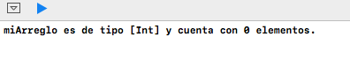
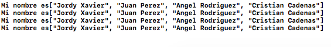
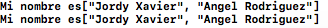
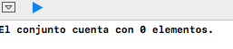
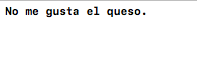

# Colección de datos

En **Swift** existen 4 tipos de colecciones de datos y en este manual se explicará cada uno de ellos con diferentes ejemplos. 

Las colecciones son de gran utilidad cuando se desea almacenar un arreglo de valores: 

* Arreglos
* Diccionarios
* Conjuntos
* Tuplas

Entonces podemos decir que, las colecciones de datos en **Swift** nos permiten agrupar  datos u objetos de una manera particular, ya sea como una lista de elementos únicos o repetidos, o sencillamente una lista de conjuntos


##Arreglos (Arrays)

En **Swift** también podemos hacer uso de los areglos y podemos definirlos como un un conjunto de datos de un mismo tipo ordenados de forma lineal. 
Los componentes de un array se han de referenciar por medio del nombre del array y un índice de desplazamiento para indicar el componente deseado.
La forma de declarar nuestro arreglo se hace de la siguientes formas:

```swift
let pais: Array = ["México", "Colombia", "Perú"]
 
let nombres: [String] = ["Jordy", "Luis", "Alejandro"]

```
Podemos notar que en ambos casos estamos declarando un Array de cadenas, "país" y "nombres" representan una constante por la cual es nombrada cada uno de nuestros arreglos

## Creación de un Array vacío
**Swift** nos permite crear arreglos vacíos de un tipo de dato en específico haciendo uso de la siguiente sintaxys

```swift
var miArreglo = [Int]()
 
print("miArreglo es de tipo [Int] y cuenta con \(miArreglo.count) elementos.")

```
Y obtendremos la siguiente salida:


También podríamos declar a nuestro arreglo vacío de las siguientes formas:

```swift
var arrayVacio: Array<String>
 
var arregloVacio: [String]

```

## Creación de un Arreglo con valores por defecto

Los Arrays en **Swift** también proporcionan un inicializador para la creación de una matriz de cierto tamaño. A este inicializador se le pasa el número de elementos que se añade al nuevo arreglo (llamado count) y un valor por defecto del tipo de dato apropiado (llamado repeatedValue):

```swift
var cincoDoubles = [Double](repeating: 1.0, count: 5)

print("el arreglo es de tipo [Double] y sus valores son: \(tresDoubles)")


```
Y obetenemos la salida siguiente: 


También **Swift** infiere el tipo de dato que estamos manejando sin necesidad de hacer ninguna referencia 

```swift    
var  nombres = ["Jordy Xevier"]

```

## Acceder y modificar los datos de un Array
Acontinuación se mostrará la forma en cómo se puede agregar elementos a un arreglo gracias a la función append

```swift    
var lista: Array<String>
 
var nombresLista = ["Jordy Xavier"]
 
nombresLista.append("Juan Perez")
nombresLista.append("Angel Rodriguez")
nombresLista.append("Cristian Cadenas")
```
 De esta forma estaremos agregando nuevos elementos a nuestro arreglo y a continución vamos a acceder los elementos de nuestro arreglo "nombresLista" y comprobar los cambios hechos
```swift    
for _ in nombresLista {
    
    print("Elementos de mi arreglo: \(nombresLista)")
    
}

```
y nuestra salida en pantalla:



Ahora vamos a eliminar 2 de los 3 elementos argregados de la siguiente forma
```swift    
var lista: Array<String>
  
nombresLista.remove(at: 1)
nombresLista.remove(at: 2)

```

Y la salida en nuestra consola cuando mandamos a imprimir será la siguiente:



En nuestros ejemplos anteriores hemos logrado trabajar con los arreglos, así como agregar y eliminar datos del mismo, que son los métodos mas usados en **Swift** 

## Conjuntos (Set)

Un conjunto o set nos permite almacenar diferentes valores de un mismo tipo sin ningún tipo de orden definido, cada uno de estos elementos es irrepetible en el conjunto, es decir, no puede aparecer mas de una vez.
Los conjuntos son usados en vez de un arreglo cuando el orden de nuestros elementos no es importante y además se quiere que cada uno de estos sea único dentro de nuestro conjunto, es decir, que no queramos que se repita.

## Creado e inicializando un conjunto

A continución vamos a crear un conjunto vacío y vamos a imprimir el número de elementos con el que cuenta

```swift    
var conjunto = Set<String>()
 
print("El conjunto cuenta con \(conjunto.count) elementos.")

```

Y el resultado en pantalla sería:




## Creando un conjunto a partir de una arreglo

**Swift** nos permite crear un conjunto de una manera muy fácil así como lo es crear un arreglo. Solo es necesario declar un arreglo con elementos, especificando que será del tipo Set. En el siguiente ejemplo vemo la forma correcta de declarar nuestro conjunto:

```swift    
let ingredientes: Set = ["ajo", "queso", "jitomate", "sal"]

```

En la variable "ingredientes" estamos almecenando los elementos necesarios para una receta de cocina, en este caso se usa un conjunto pues en una lista de ingredientes no es posible que exista alguno repetido y si recordamos anteriormente se mencionó que en un conjunto solo existirán elementos que no podrán repetirse. 

Ahora vamos a interactuar con nuestro conjunto:

```swift    
let ingredientes: Set = ["ajo", "queso", "jitomate", "sal"]
if ingredientes.contains("queso") {
    print("No me gusta el queso.")
}
```



